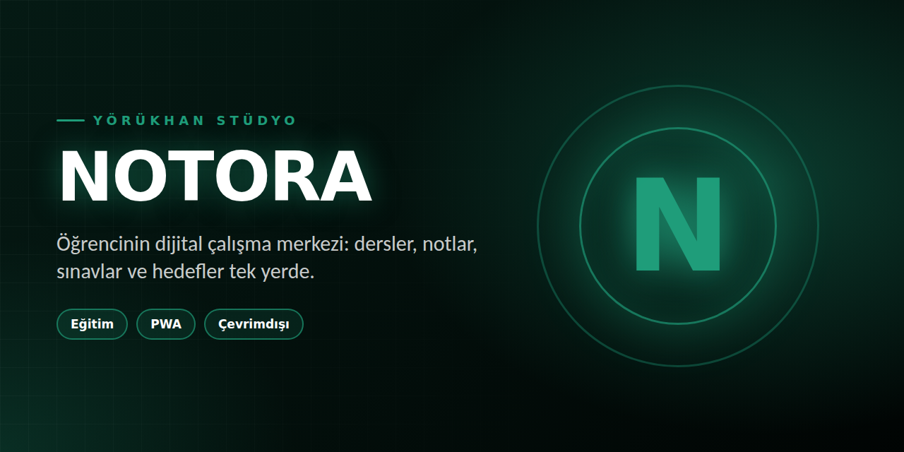

# Notora — University Study Hub

Notora, üniversite öğrencisinin ders, sınav, araştırma, kariyer ve akademik yaşam bilgisine tek noktadan ulaşmasını hedefleyen bir bilgi ve çalışma merkezidir.

## Bugünkü mimari

- Supabase veri katmanı
- Gerçek Auth (e-posta/şifre)
- RLS ile kullanıcı bazlı erişim
- Storage ile öğrenci dosyaları
- Bilgi kaynağı kataloğu: 51 doğrulanmış/kurumsal-akademik kaynak
- Ders haritası: 90 alan/sınıf/konu kaydı
- Akademik takvim: 2026 sınav ve burs kayıtları
- Topluluk notları: öğrenci yüklemeli PDF/DOC/DOCX/PPT/PPTX/TXT
- Çalışma araçları: GANO, Pomodoro, günlük görevler
- PWA: manifest + offline shell + service worker

## Güven modeli

Kaynaklar üç ayrı sınıfta tutulur:

1. Resmî kaynak: kurumun kendi web yayını (YÖK, ÖSYM, TÜBİTAK, İŞKUR, e-Devlet vb.)
2. Doğrulanmış dış kaynak: akademik/eğitim kurumu veya açık eğitim platformu (MIT OpenCourseWare, OpenStax, PubMed, DOAJ, Crossref, Google Scholar vb.)
3. Öğrenci kaynağı: topluluk tarafından yüklenen dosya.

Notora dış web içeriğini kopyalayıp kendi içeriği gibi sunmaz; kaynağın kimden geldiğini ve bağlantısını gösterir.

## Ders haritası

study_catalog tablosu üniversiteye özgü zorunlu müfredat iddiasında bulunmadan genel bir akademik yol haritası sağlar. Üniversite ve programların gerçek ders planları zaman içinde değişebileceği için resmî müfredat bağlantıları ayrıca kaynak olarak gösterilmelidir.

Alanlar:
- Genel Akademik
- Bilgisayar
- Mühendislik
- Elektrik-Elektronik
- İktisat
- İşletme
- Hukuk
- Sağlık
- Fen Bilimleri
- Sosyal Bilimler

Her alan 1–4. sınıf seviyelerinde konu başlıklarına ayrılmıştır.

## Mobil gelecek

Web sürümü PWA olarak hazırlanmıştır. Aynı Supabase şeması ileride React Native/Expo, native iOS/Android veya başka bir istemci tarafından API üzerinden kullanılabilecek şekilde tutulur.

## Production veri modeli

profiles
notes
note_likes
bookmarks
note_ratings
note_download_events
knowledge_resources
academic_events
study_catalog

## Sonraki teknik katman

- kaynak doğrulama kuyruğu
- bozuk bağlantı otomatik taraması
- yönetici paneli
- üniversite/program veri importları
- konu → kaynak → not ilişkileri
- gelişmiş tam metin arama
- kişiselleştirilmiş öğrenci ana sayfası
- bildirimler ve yaklaşan sınav/başvuru hatırlatıcıları
- mobil istemci

## Türkiye üniversite/program kataloğu

Arayüzdeki katalog, 2025 YÖK Atlas tabanlı açık veriden derlenen 224 üniversite/kurum, 2.765 farklı program türü ve 21.542 üniversite-program kaydını içerir. Kaynak veri: cngil/turkiye-university-programs (CC BY 4.0). Katalog yeni YÖK Atlas verisi yayımlandıkça güncellenmelidir.

---

© 2026 YÖRÜKHAN STÜDYO — Tüm hakları saklıdır. Bu projenin kodu, tasarımı, oyun fikri ve görselleri izinsiz kopyalanamaz, çoğaltılamaz veya ticari amaçla kullanılamaz.
